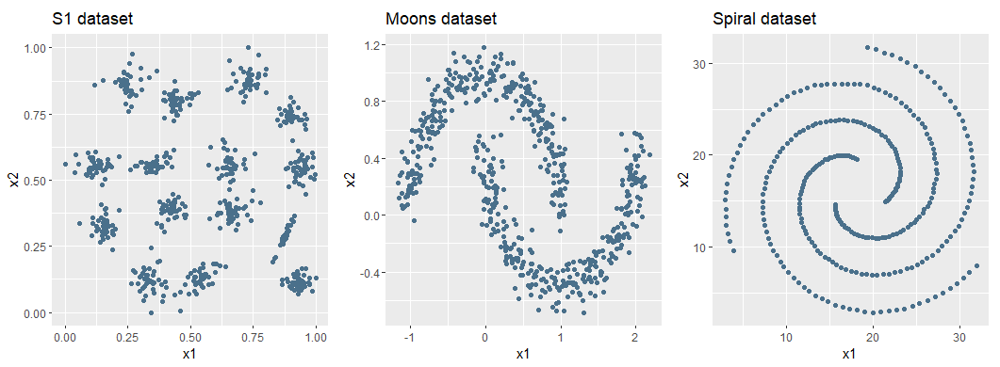
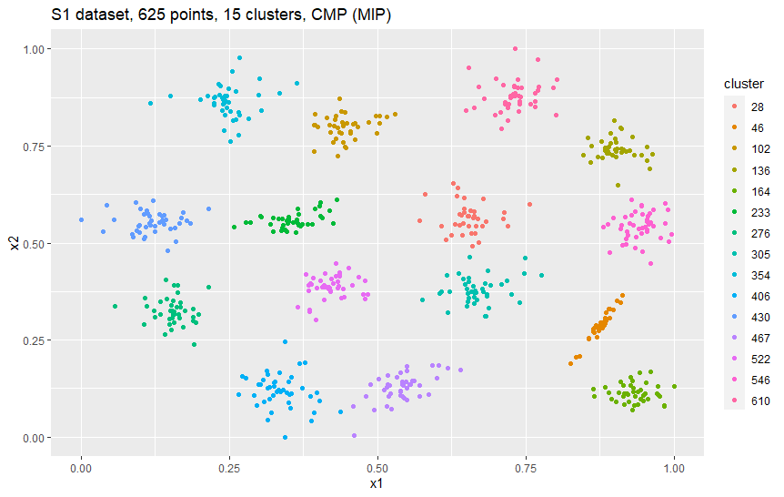
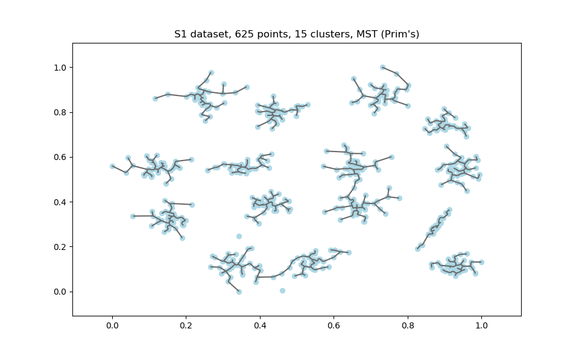
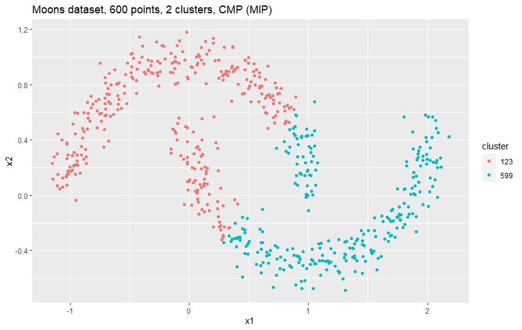
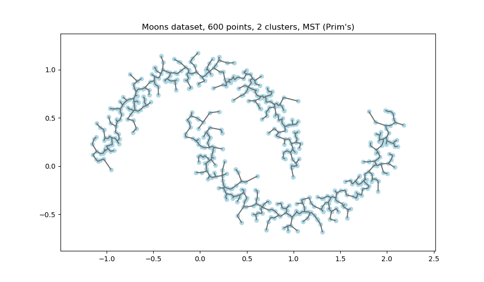
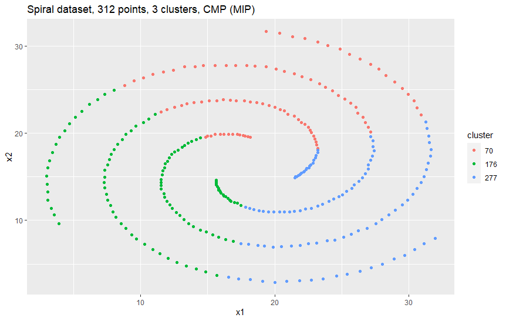
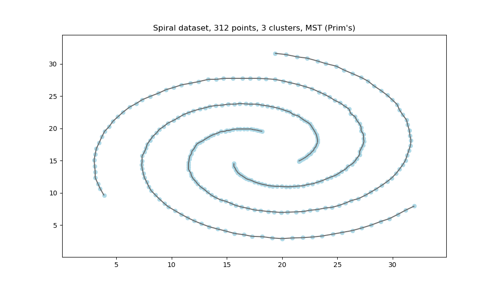

# The Cluster-Median Problem

The objective of this project is to implement different cluster analysis tools in order to separate data from three datasets. It is part of the course on integer optimization.

## About

**Course**  
Optimization Techniques for Data Mining (OTDM-MIRI)  
FIB - Universitat Politècnica de Catalunya. BarcelonaTech  
December 2021 

**Team**  
* Marcel Cases
&lt;marcel.cases@estudiantat.upc.edu&gt;
* Mengxue Wang
&lt;mengxue.wang@estudiantat.upc.edu&gt;

## Introduction

Cluster analysis or clustering is a method of unsupervised learning and a common technique for statistical data analysis widely used in many fields, including machine learning, data mining, pattern recognition, image analysis and bioinformatics. This project deals with two particular cases of clustering known as the **Cluster-Median Problem** (CMP) and the **Minimum Spanning Tree** (MST).

In this project, we implement the mathematical formulation of the Cluster-Median Problem (as a **Mixed-Integer Program**) with AMPL. We also implement another solution for clustering, an heuristic approach of the Minimum Spanning Tree using **Prim's algorithm** developed with Python. We apply it to three different datasets of different sizes that contain data distributed in different shapes, and finally we compare the obtained results and make conclusions, both visually and analytically.

## Models

The overall objective of general clustering methods is the following: given a data matrix *A = a<sub>ij</sub>*, *i = 1..m*, *j = 1..n* of *m* points (samples) and *n* variables (features, dimensions), group them in *k* clusters (being *k* a predefined parameter) such that the points in each cluster are similar.

### Cluster-Median Problem

In the Cluster-Median Problem, the criteria for similarity is that the overall distance of all the points to the median of the clusters that they belong to is minimized.

The CMP is formulated as a Mixed-Integer Program (MIP) to be solved with CPLEX.

The model is as follows: given a distance matrix *D = d<sub>ij</sub>*, *i,j = 1..m* that contains the Euclidean distance of each pair of points calculated from the matrix *A*, and a binary decision variable *x<sub>ij</sub>* = {0,1}, *i = 1..m*, *j = 1..n* such that:


We define the objective function of the problem as the minimum distance of all points to their cluster medians:


The problem is subjected to three constraints, being the first one every point belongs to one cluster (c<sub>1</sub>):


There must be exactly *k* clusters (c<sub>2</sub>):


A point may belong to a cluster only if the cluster exists (c<sub>3</sub>):


The last group of m<sup>2</sup> constraints can be formulated in an alternative way that reduces the number of constraints, but we have proved that this alternative formulation has a worse performance in execution time and requires more MIP simplex iterations.

The AMPL code of the preprocessing script that computes Euclidean distances matrix D (contained in *cmp.run*) can be found in *Annex I: AMPL code of the Euclidean distances matrix computation*.

The AMPL code of the Cluster-Median Problem formulation *(cmp.mod)* can be found in *Annex II: AMPL code of the Cluster-Median Problem formulation*.

### Minimum Spanning Tree

Given the same Euclidean distances matrix *D* as before, the goal of the Minimum Spanning Tree is to compute a subset of edges that minimize the total weight of the edges, visiting all the nodes only once and avoiding cycles. In our problem, weights are distances. In other words, the MST is a way to connect all nodes in the data matrix *A* minimizing the total distance.

There are many ways to calculate the Minimum Spanning Tree. In our project we implemented Prim’s algorithm, an heuristic solution that makes greedy decisions at each step from the starting point.

The steps Prim's algorithm goes through are:

* Select any starting node (manually or at random)
* Explore the neighboring distances and move to the closest node
* Add the segment to the set of computed segments
* Repeat the process until there are no nodes left

Given *k*, we want to cluster the data in *k* clusters from the results of the Prim's algorithm as follows:

* Remove the *k-1* arcs with the largest distances

The Python code of the preprocessing script that computes Euclidean distances matrix D (contained in *mst.py*) can be found in *Annex III: Python code of the Euclidean distances matrix computation*.

The Python code of the Prim's algorithm for computing the Minimum Spanning Tree (contained in *mst.py*) can be found in *Annex IV: Python code of the Prim's Minimum Spanning Tree algorithm*

## Datasets

We use three different datasets to test the performance of the two previously described clustering techniques. Although the models accept any n-dimensional dataset, we will use only two-dimensional data for visualization purposes and to obtain conclusions from the visual analysis.

The plots below show an overview of the datasets:



### S1 dataset

S1 dataset was obtained from a [repository by the University of Eastern Finland - Joensuu](http://cs.joensuu.fi/sipu/datasets/) (credited to *P. Fränti and O. Virmajoki, "Iterative shrinking method for clustering problems", Pattern Recognition, 39 (5), 761-765, May 2006*). It consists of 15 theoretical Gaussian clusters "blobs" with different degree of overlap. Samples have been generated synthetically. For our project, we reduced the size from 5000 to 625 samples, and we applied rescaling (min-max normalization) to avoid working with extremely large objective function values.

### Moons dataset

Moons dataset consists of two interleaving half circles. It was generated using `sklearn` with the script below, and contains 600 samples with some noise. Each one of the half-moons makes up one cluster (two theoretical clusters in total). 

````python
from sklearn.datasets import make_moons
X, y = make_moons(n_samples = 600, shuffle=True, noise = 0.09)
````

The full code of the Moons dataset generator can be found in *Annex V: Python code of the Moons dataset generator*.

### Spiral dataset

Spiral dataset was also obtained from the repository of the University of Eastern Finland (credited to *H. Chang and D.Y. Yeung, Robust path-based spectral clustering. Pattern Recognition, 2008. 41(1): p. 191-203*). It contains three spirals (three theoretical clusters) that are also interleaved, with a very low noise. It is made of 312 points.

## Results and analysis

We have run both CMP and MST with the three different datasets to obtain the optimal objective value and an execution time. In the case of the CMP, we get an assignation of a cluster to each point as a solution. For the MST, we get the set of segments that minimize the sum of distances among nodes.

Given that we work with two-dimensional datasets, the data can be easily represented in plots. In CMP, we represent each cluster with a unique color. In MST, we represent all segments of the tree after it has been partitioned by the amount of *k* predefined clusters.

The code of the two plotters can be found in:

* CMP plotter: *Annex VI: R code of the CMP plotter*
* MST plotter: *Annex VII: Python code of the MST plotter*

### S1 dataset

Plot of the Cluster-Median Problem solution as a Mixed-Integer Program:



Plot of the Minimum Spanning Tree solution obtained with Prim's algorithm:



### Moons dataset

Plot of the Cluster-Median Problem solution as a Mixed-Integer Program:



Plot of the Minimum Spanning Tree solution obtained with Prim's algorithm:



### Spiral dataset

Plot of the Cluster-Median Problem solution as a Mixed-Integer Program:



Plot of the Minimum Spanning Tree solution obtained with Prim's algorithm:



### Analysis

In S1 dataset, CMP perfectly clustered the data in groups of similar size of points, while MST also created clusters of data but has a tendency to leave distant single points isolated in clusters of one point. Furthermore, MST joins some of the clusters that overlap. This is a consequence of the greedy behavior. CMP outperforms MST in terms of quality of the solution.

It can be observed from Moons dataset results, where the data has a well-defined shape, that CMP is not able to identify the original shape and clusters the points by partitioning the two "natural" clusters. On the other side, MST is able to adapt its segments to the shape of the data. In this dataset, MST clearly outperforms CMP.

In Spiral dataset, we obtain similar results as in the Moons, where CMP is not able to identify the shape of the data but MST does it very well.

### Performance

| Dataset | Samples (M) | Dimensions (N) | Clusters (K) | Algorithm | Obj. value | Time (s) |
|---------|-------------|----------------|--------------|-----------|------------|----------|
| S1      | 625         | 2              | 15           | CMP       | 24.08      | 97.20    |
| S1      | 625         | 2              | 15           | MST       | 9.61       | 26.58    |
| Moons   | 600         | 2              | 2            | CMP       | 364.31     | 192.98   |
| Moons   | 600         | 2              | 2            | MST       | 24.91      | 22.50    |
| Spiral  | 312         | 2              | 3            | CMP       | 1811.10    | 11.42    |
| Spiral  | 312         | 2              | 3            | MST       | 188.62     | 3.18     |

Regarding the performance, we observe that the heuristic approach always requires less computing time to reach a solution, although the solution may not be the optimal, while the integer programming model ensures the optimal solution but with more time, in the order of x4 times the heuristic. The heuristic time increases a little more than linearly with the size, while the integer programming solver increases a lot more with size. The distribution of the data in the dataset also has an influence in the computing time.

The values of the objective function that have been obtained do not bring any information. The reason is that we are optimizing different, unrelated functions:

* In CMP, we compute the minimum distance of all points to their cluster medians
* In MST, we compute the subset of edges that minimize the total weight of the edges, visiting all the nodes only once and avoiding cycles 

This is why we can not make conclusions from the objective values.

## Conclusions

After performing the tests, we have observed that CMP finds more fairly balanced clusters than MST in number of points, but requires a lot of computing time in large instances. It guarantees to provide the optimal solution. Works especially good with homogeneous data.

MST is more adaptive to data with determined shapes (such as worms or spirals). Given its greedy approach, MST has a tendency to leave periferic clusters with a single element. MST does not guarantee balanced clusters. It is a good solution for data discovery purposes.

There is no strong conclusion on which of the two algorithms is better. They are all valid and good depending on many factors, such as the shape of the data, size of the dataset, or computing availability.

## Files in the project

| File            | Description                                                                                                                           |
|-----------------|---------------------------------------------------------------------------------------------------------------------------------------|
| `cmp.mod`       | AMPL code of the CMP model                                                                                                            |
| `cmp.run`       | AMPL runfile, with preprocessing, solving and post-processing (data reporting)                                                    |
| `mst.py`        | Prim's algorithm of the MST in Python. Contains preprocessing, the algorithm, plotting and data reporting                                             |
| `data/*.dat`    | AMPL input data for each dataset                                                                                                      |
| `data/*.py`     | Python input data for each dataset                                                                                                    |
| `gen/gen.py`    | Moons dataset generator                                                                                                               |
| `gen/plot.r`    | R script to plot CMP (AMPL) solutions                                                                                                   |
| `gen/*.csv`     | Output data from CMP (AMPL) (coord. + cluster), adapted to be read by `gen/plot.r`                                                    |
| `img/*`         | Plots of the CMP and MST solutions                                                                                                      |
| `out/*cmp.txt` | AMPL output logs of the CMP. Contains which cluster each point belongs to, num. of MIP simplex iterations, exec. time and obj.f value |
| `out/*mst.txt` | Python output logs of the MST. Contains all computed segments, weights, exec. time and obj.f value                                    |

## References

Task statement  
Class slides  
AMPL documentation  
Nocedal, J.; Wright, S.J. *Numerical optimization*  

## Annex I: AMPL code of the Euclidean distances matrix computation

````AMPL
param partsum default 0;
for {i in {1..m}} {
	for {j in {1..m}} {
		for {dim in {1..n}} {
			let partsum := partsum + (A[j,dim] - A[i,dim])^2
		}
		let D[i,j] := sqrt(partsum);
		let partsum := 0;
	}
}
````

## Annex II: AMPL code of the Cluster-Median Problem formulation

````AMPL
param k;
param m;
param n;

param A{i in 1..m, j in 1..n};
param D{i in 1..m, j in 1..m};


var x{i in 1..m, j in 1..m} binary;

# Distance of all points to their cluster medians
minimize objf:
	sum{i in 1..m, j in 1..m} D[i,j]*x[i,j];
	
# Every point belongs to one cluster
subject to c1 {i in 1..m}:
	sum{j in 1..m} x[i,j] = 1;
	
# Exactly k clusters
subject to c2:
	sum{j in 1..m} x[j,j] = k;

# A point may belong to a cluster only if the cluster exists
subject to c3 {i in 1..m, j in 1..m}:
	x[j,j] >= x[i,j];
````

## Annex III: Python code of the Euclidean distances matrix computation

````python
def dist():
    D = np.zeros((M,M))
    # print(D)
    for mi in range(M):
        for mj in range(M):
            partsum = 0
            for n in range(N):
                partsum += (A[mj][n] - A[mi][n])**2
            D[mi,mj] = math.sqrt(partsum)
    return D
````

## Annex IV: Python code of the Prim's Minimum Spanning Tree algorithm

````python
def prims():
    # Calculate MST
    node = np.zeros((M)) # initial node
    node[0] = True
    print("Edge : Weight\n")
    segments = []
    weights = np.zeros((M))
    idx = 0
    while (idx < M-1):
        incumbent = 10**8 # current minimum value, initial set to +inf
        x1,x2 = 0,0
        for m1 in range(M):
            if node[m1]:
                for m2 in range(M):
                    if ((not node[m2]) and D[m1,m2]):  # node not in selected, edge present
                        if incumbent > D[m1,m2]:
                            incumbent = D[m1,m2]
                            x1,x2 = m1,m2
        segments.append([(A[x1,0],A[x1,1]),(A[x2,0],A[x2,1])])
        weights[idx] = D[x1,x2]
        print("("+str(A[x1,0])+","+str(A[x1,1])+") -> " + "("+str(A[x2,0])+","+str(A[x2,1])+")" + " : " + str(D[x1][x2]))
        node[x2] = True
        idx += 1
    # The k-1 arcs with largest distances will be removed to obtain k clusters form the MST
    largest_weights_idx = (np.argpartition(weights, -(K-1))[-(K-1):]).tolist()
    clustered_segments = segments.copy()
    for i in sorted(largest_weights_idx, reverse=True):
        del clustered_segments[i]
    return clustered_segments,weights
````

## Annex V: Python code of the Moons dataset generator

````python
from sklearn.datasets import make_moons
from matplotlib import pyplot as plt
from matplotlib import style
from numpy import savetxt
 
X, y = make_moons(n_samples = 600, shuffle=True, noise = 0.09)
plt.scatter(X[:, 0], X[:, 1], s = 40, color ='g')
plt.xlabel("X")
plt.ylabel("Y")

print(X)

savetxt('moons.dat', X, delimiter=',', fmt='%1.6f')
 
plt.show()
plt.clf()
````

## Annex VI: R code of the CMP plotter

````r
library(ggplot2)

X <- read.csv("moons.csv",header = TRUE)
X[1:5,]

ggplot(X, aes(X[,1],X[,2],color=factor(X[,3])))+
  geom_point()+
  labs(title="Moons dataset, 600 points, 2 clusters, CMP (MIP)",x="x1",y="x2",colour="cluster")
````

## Annex VII: Python code of the MST plotter

````python
def plotMST():
    lc = mc.LineCollection(clustered_segments, linewidths=1.5,colors="dimgray") #linewidths=1.5
    fig, ax = pl.subplots()
    ax.add_collection(lc)
    ax.scatter(A[:, 0], A[:, 1],c="lightblue",linewidth=.7)
    ax.autoscale()
    ax.margins(0.1)
    pl.title("Moons dataset, 600 points, 2 clusters, MST (Prim's)")
    pl.show()
````


